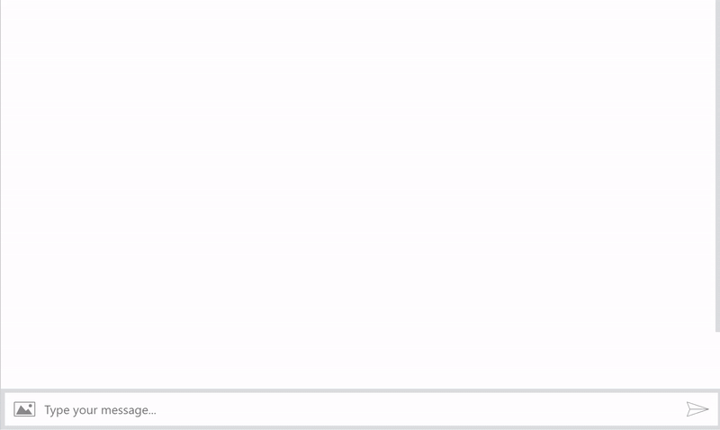
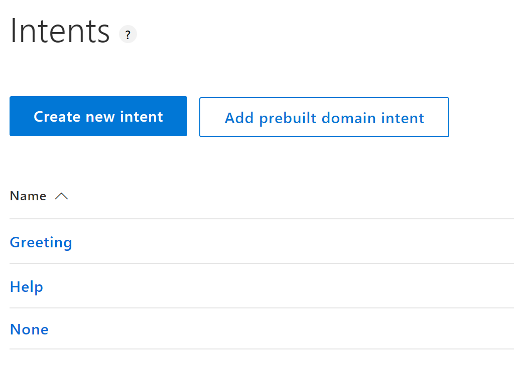
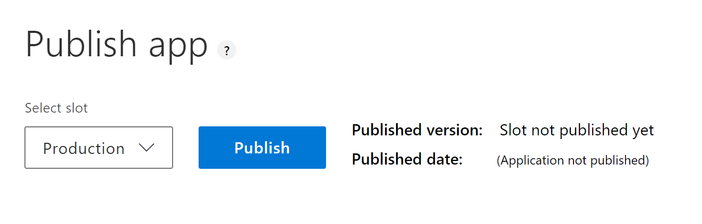
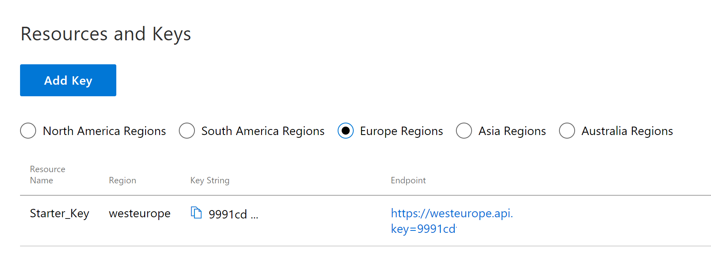
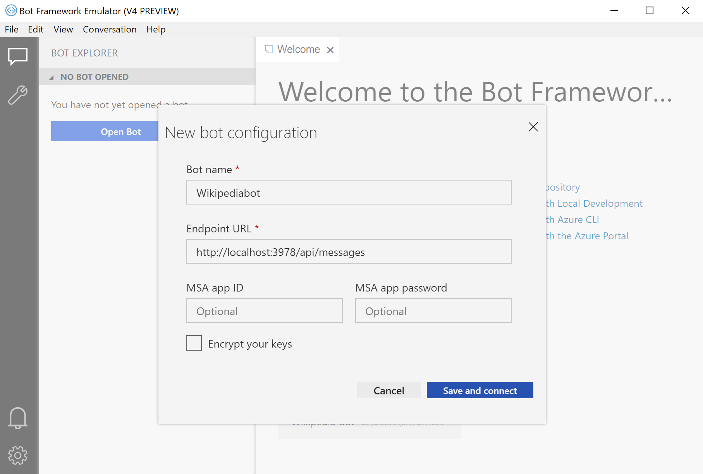

# Bot Starter Project
This is a starter project for bot development using TypeScript + Node.js and Microsoft Bot Framework. The Bot answers questions by leveraging the Wikipedia-API and returns a set of relevant articles.

<p align="center">
  
</p>

## Getting started

### 0) Prerequisites
If you haven't done it so far, install the following tools:
1. <a href="https://nodejs.org/en/download/" target="_blank">Node.js</a>
2. <a href="https://www.typescriptlang.org/#download-links" target="_blank">TypeScript</a>
3. <a href="https://github.com/Microsoft/BotFramework-Emulator/releases" target="_blank">Bot Framework Emulator</a>
4. Your favorite IDE (if you need a recommendation... take <a href="https://code.visualstudio.com/download" target="_blank">Visual Studio Code</a>!)

Alternatively, you can install Visual Studio with NodeJS Workload.

### 1) Install the Bot
Download or clone this repository
```
git clone https://github.com/christian-vorhemus/bot-starter-project.git
```
Open a console/terminal and switch to the Bot-Starter directory (this is the directory where package.json is located). Type
```
npm install
```
to install the necessary node packages. This may take a while.

### 2) Create a new LUIS app
In messenger applications, people expect that they can communicate in natural language. Since users can ask many different questions, we need a kind of "switch" to forward a request to the right dialogue. LUIS is such a natural language processing tool, it takes a sentence and categorizes it.
To create a new LUIS application, go to https://eu.luis.ai/ and log in with your Microsoft account.
Click on "Import new app" and select the file _BotStarter-LUIS.json_ in the LUIS folder from the source code. You should now see the "Intents" page.



Our Bot understands three types of questions: Greeting, Help and SearchRequest. If you click on "Greeting", you'll see sample sentences (utterances). Whenever a user types a sentence similar to these, this should be treated as a greeting in our bot. Thanks to the power of neural networks, you don't have to enter all conceivable greetings, several samples should be enough for LUIS to learn, how greetings typically look like.

To start the learning process, click on "Train" in the upper right corner, this just takes a few seconds.
Next, go to the "Publish" page and click on "Publish".



If you have published the Bot in the Europe regions, switch to this tab and copy the endpoint URI



Finally, open _Bot-Starter/settings/index.ts_ and replace the variable value of _luisAppUrl_ with your URI
```
export const luisAppUrl = '<PASTE ENDPOINT HERE>';
```

### 3) Run the Bot
If you have Visual Studio installed, just open
```
Bot-Starter.sln
```
and press F5 to build and run the Bot. The Bot is listening on http://localhost:3978.

Otherwise, just type 
```
npm run build
```
to build the app and 
```
npm start
```
to run the Bot.

### 3) Test the Bot

Open Bot Framework Emulator and click on _File_ > _New Bot_. Enter a name for your bot and the URI our bot is listening on (in this example it would be http://localhost:3978/api/messages). Click on "Save and connect".



Bot Framework Emulator may be a bit laggy, but after a while you should be able to type messages into the textfield and receive answers


